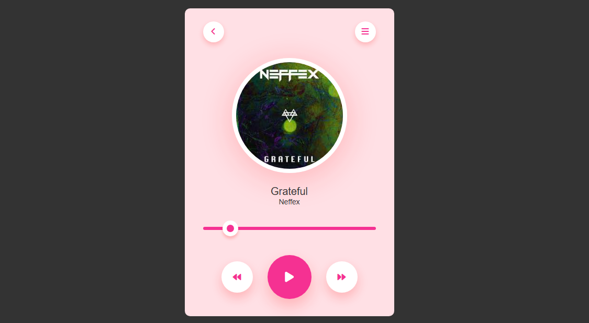

# 🎵 Media Player

A lightweight and responsive Media Player built using **HTML**, **CSS**, and **JavaScript**. This player allows you to play and pause audio files, displays a real-time progress bar, and uses an internally stored song (i.e., local audio file).

## ✨ Features

- 🔊 **Play and Pause** functionality  
- ⏱️ **Real-time Music Progress Bar**  
- 📁 **Internal Storage** – audio file stored locally within the project  
- 🎷 Clean and minimal UI using modern CSS  

## 📸 Screenshots



## 🚀 How to Use

1. **Clone the Repository**
   ```bash
   git clone https://github.com/rustom0/media-player.git
   ```

2. **Open the Project**
   - Navigate to the project folder.
   - Open `index.html` in your browser.

3. **Enjoy your music!**

## 📂 File Structure

- `index.html` – main structure of the media player  
- `style.css` – custom styles for the UI  
- `script.js` – JavaScript logic for audio controls and progress bar  
- `assets/song.mp3` – locally stored music file

## ⚙️ Functionality

- The **Play** button starts the song.
- The **Pause** button stops playback.
- The **progress bar** updates in real time as the song plays.

## 📌 Notes

- This player is designed to work with a local `.mp3` file. Make sure your `song.mp3` is placed in the correct directory (`/assets` by default).
- It works best on modern browsers.

## 📄 License

This project is open source and free to use.

